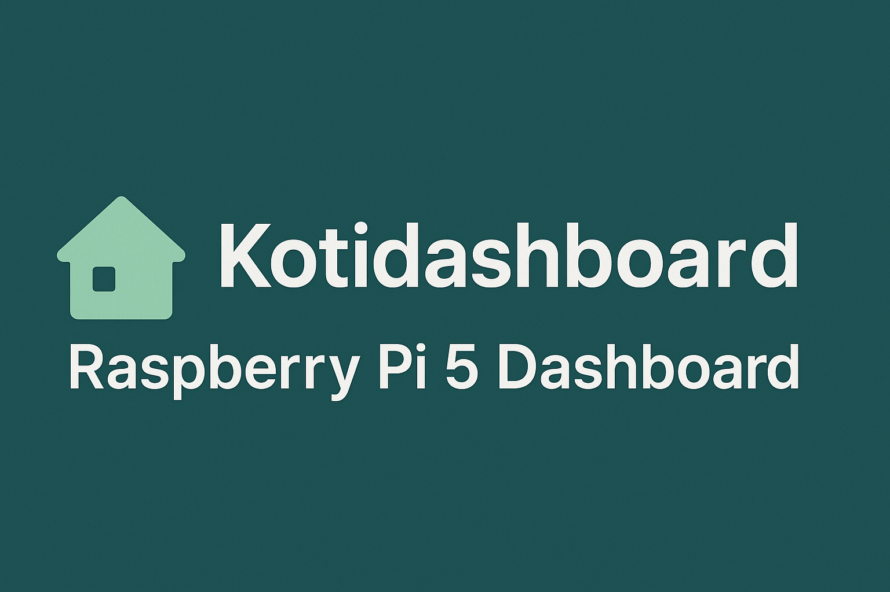
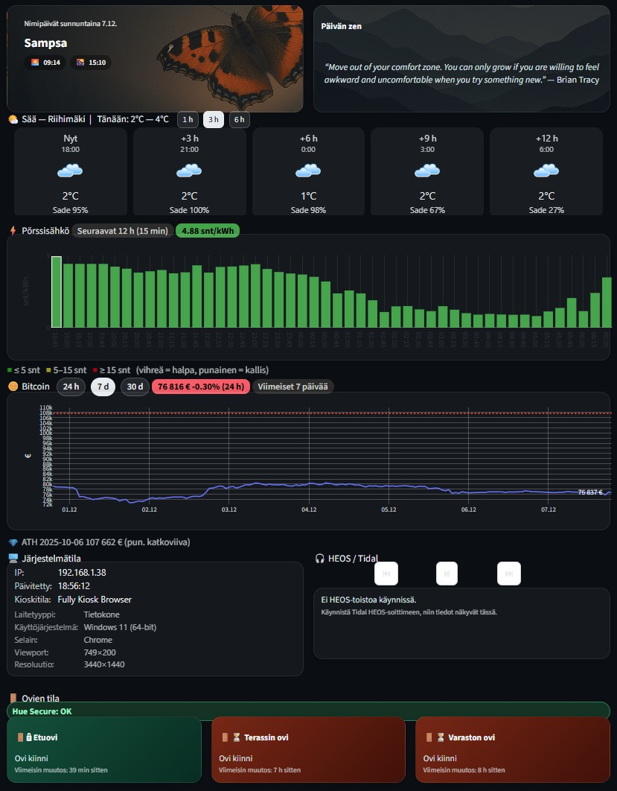

# 🏠 Kotidashboard

> **Kotidashboard** on Streamlit-pohjainen kojelauta, joka kokoaa keskeiset arjen tiedot yhdelle näytölle.
> Sovellus hakee reaaliaikaisia tietoja muun muassa säästä, sähkön hinnasta, Bitcoinin kurssista, nimipäivistä ja järjestelmän tilasta.
> Toteutus toimii sekä **Windowsissa** että **Raspberry Pi 5**:llä ja päivittyy suoraan GitHubista yhdellä komennolla.

---

## ✨ Ominaisuudet

- ⚡ Sähkön hinta (Nord Pool / Pörssisähkö API)
- ☀️ Sää Open-Meteosta (lämpötila, sademäärä, pilvisyys, ikoni)
- ₿ Bitcoinin hinta CoinGeckosta
- 📅 Nimipäivät ja pyhät
- 🧘 Satunnainen Zen-lause taustakuvalla
- 🖥️ Järjestelmän tila (CPU, RAM, levytila)
- 💾 Lokitus `logs/homedashboard.log` -tiedostoon
- 🔄 Automaattinen päivitys ja välimuisti
- 🎧 HEOS / Tidal -integraatio (nykyinen kappale + ohjauspainikkeet)

---

## 📸 Kuvakaappaus



---

## ⚙️ Keskeiset teknologiat

| Osa | Teknologia |
|:----|:------------|
| Käyttöliittymä | [Streamlit](https://streamlit.io) |
| Datalähteet | Open-Meteo, Pörssisähkö API, CoinGecko, Yle API |
| Kieli / ympäristö | Python 3.13 + venv |
| Palvelin | Raspberry Pi 5 (8 GB) |
| Visualisointi | Plotly, Mermaid |
| Versionhallinta | Git / GitHub |

---

## 📁 Hakemistorakenne

```text
HomeDashboard/
├── 📦 src/          # Sovelluskoodi (api.py, ui.py, utils.py, config.py, ...)
├── 🎨 assets/       # Tyylit, ikonit ja taustakuvat
├── 📊 data/         # JSON- ja XLSX-data
├── 📚 docs/         # Dokumentaatio ja kaaviot
├── 🧰 scripts/      # Asennus- ja päivitysskriptit
├── 🧪 tests/        # Yksikkötestit
├── 🪵 logs/         # Lokitiedostot
├── 🧩 .venv/        # Virtuaaliympäristö
├── 🚀 main.py       # Streamlit-sovelluksen entrypoint
└── 📘 README.md
```

## 📊 Data

Projektissa käytetään paikallista dataa seuraavista poluista:

- `data/nimipaivat_fi.json` – suomenkielinen nimipäivälista kuukausittain (tammikuu → päivä → nimet). Tätä käyttää nimipäiväkortti.
- `data/pyhat_fi.json` – suomalaiset pyhä- ja liputuspäivät, joita nimipäiväkortti voi näyttää “chippinä” päivän otsikon alla.

Jos ajat dashboardia eri hakemistosta tai Raspberry Pi:ltä, varmista että nämä kaksi tiedostoa ovat mukana `data/`-kansiossa, muuten `card_nameday()` näyttää vain viivan.

---

## 🪟 Asennus (Windows)

1. Asenna Python 3.10+ (tarkista että `py` toimii komentoriviltä).
2. Kloonaa repo:
   ```powershell
   git clone https://github.com/<oma-kayttaja>/kotidashboard.git
   cd kotidashboard
   ```
3. Luo virtuaaliympäristö:
   ```powershell
   py -m venv .venv
   .\.venv\Scripts\activate
   ```
4. Asenna riippuvuudet:
   ```powershell
   pip install --upgrade pip
   pip install -r requirements.txt
   ```
5. Tee asetukset:
   ```powershell
   copy .env.example .env
   # Muokkaa .env ja lisää API-avaimet, sijainti jne.
   ```
6. Käynnistä:
   ```powershell
   streamlit run main.py --server.address 0.0.0.0 --server.port 8787
   ```
7. Avaa selain osoitteessa **http://localhost:8787**

---

## 🍓 Asennus (Raspberry Pi 5)

1. Päivitä paketit:
   ```bash
   sudo apt update && sudo apt upgrade -y
   sudo apt install -y python3 python3-venv python3-pip git
   ```
2. Kloonaa repo:
   ```bash
   cd /home/admin
   git clone https://github.com/<oma-kayttaja>/kotidashboard.git
   cd kotidashboard
   ```
3. Luo virtuaaliympäristö:
   ```bash
   python3 -m venv venv
   source venv/bin/activate
   ```
4. Asenna riippuvuudet:
   ```bash
   pip install --upgrade pip
   pip install -r requirements.txt
   ```
5. Kopioi asetukset:
   ```bash
   cp .env.example .env
   nano .env   # täytä arvot
   ```
6. Kokeile käynnistystä:
   ```bash
   streamlit run main.py --server.address 0.0.0.0 --server.port 8787
   ```
7. (Valinnainen) Käynnistys systemd-palveluna:
   ```bash
   sudo cp examples/kotidashboard.service /etc/systemd/system/
   sudo systemctl daemon-reload
   sudo systemctl enable kotidashboard
   sudo systemctl start kotidashboard
   ```

---

## 🧾 License

This project is licensed under the **MIT License** — see the [LICENSE](LICENSE) file for details.

---

## 🙌 Kiitokset

Datalähteet:
- [porssisahko.net](https://api.porssisahko.net)
- [sahkonhintatanaan.fi](https://www.sahkonhintatanaan.fi)
- [Open-Meteo](https://open-meteo.com/)
- [CoinGecko](https://www.coingecko.com/)
- [Finnish Namedays API](https://fi.fi/)

Kehittäjä: **Pekko Vehviläinen**, 2025
