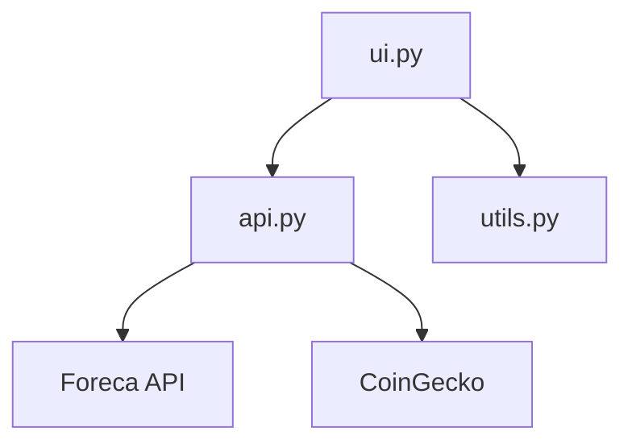
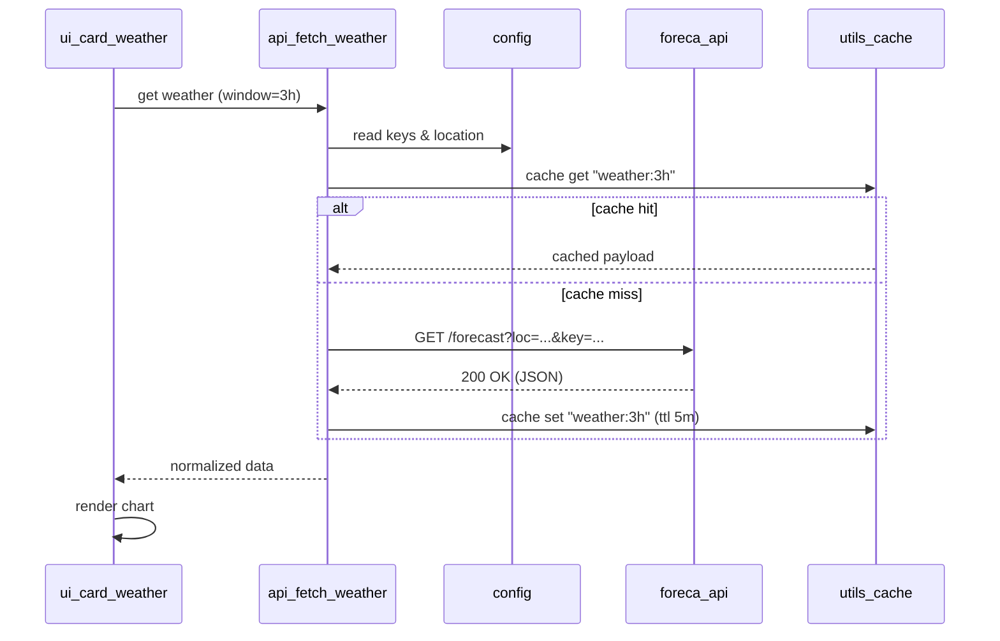

Koodin päivittäminen:

-Kirjaudu ssh:lla Raspberryyn:
 "ssh admin@RaspberryPi5"

- Syötä salasana:
 "admin@raspberrypi5's password: xxxxxxxxx"

- Hae tuorein versio GitHub:ista ja käynnistä palveu uudelleen:
 "update-dash"

## Arkkitehtuuri

## Sekvenssi: Sääkortti

