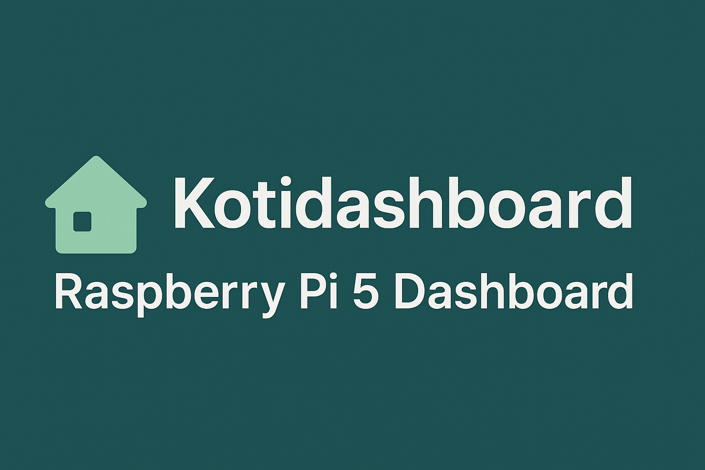
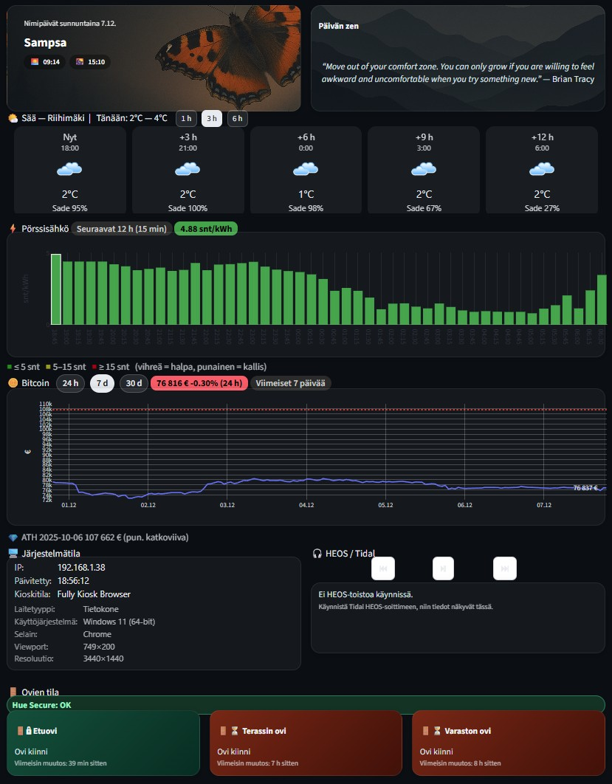

# 🏠 Kotidashboard

> **Kotidashboard** is a Streamlit-based home dashboard that brings essential daily information into a single, elegant view.
> It displays real-time data including weather, electricity prices (hourly and 15-min), Bitcoin trends, Finnish namedays, system status, and smart home sensors.
> Runs seamlessly on both **Windows** and **Raspberry Pi 5**, with simple Git-based updates.



---

## ✨ Features

- ⚡ **Electricity prices** (Nord Pool / Pörssisähkö API — 60 min + 15 min resolution)
- ☀️ **Weather from Open-Meteo** (temperature, wind, precipitation, cloud cover, WMO icons)
- ₿ **Bitcoin price & history** (24h / 7d / 30d via CoinGecko)
- 📅 **Finnish namedays & national holidays**
- 🧘 **Random Zen quote** with a background image
- 🎧 **HEOS / Tidal integration** (now playing, controls, error handling)
- 🚪 **Hue Secure door & motion sensors** (Philips Hue v2 API)
- 🖥️ **System status** (CPU, RAM, disk, IP)
- 🌿 **Pollen conditions for Riihimäki** (birch, grasses and mugwort, current levels and forecast)
- 🌙 **Daily Moon phase** in place of the pollen card when no pollen is detected
- 💾 **Logging** to `logs/homedashboard.log`
- 🔄 **Automatic refresh & caching**

---

## 📸 Screenshot



---

## ⚙️ Core Technologies

| Component | Technology |
|-----------|------------|
| Frontend | Streamlit |
| Data sources | Open-Meteo, Pörssisähkö API, CoinGecko, Yle API |
| Language | Python 3.13 |
| Hardware | Raspberry Pi 5 (8 GB), Windows |
| Visualization | Plotly, Mermaid |
| Code quality | Ruff, Pytest, Coverage, Bandit, pre-commit |
| Version control | Git / GitHub |

---

## 📁 Folder Structure

```text
HomeDashboard/
├── src/            # Application code (api/, ui/, viewmodels/, utils/...)
├── assets/         # Styles, icons, backgrounds
├── data/           # JSON and XLSX datasets
├── tests/          # Unit tests
├── docs/           # Documentation
├── scripts/        # Installation & maintenance scripts
├── logs/           # Log files
└── main.py         # Streamlit entrypoint
```

---

## 📊 Local Data Files

The dashboard uses the following local data sources:

- `data/nimipaivat_fi.json` — Finnish namedays
- `data/pyhat_fi.json` — Finnish holidays & flag days

If these files are missing, the nameday card will display only the date.

---

## 🌿 Pollen and Moon Phase

The pollen card displays current levels and forecasts for birch, grasses and
mugwort in the Riihimäki area based on the University of Turku pollen bulletin.
When all three current levels are **not detected**, the Moon card appears in the
same position. Forecast pollen alone does not prevent the switch. If the pollen
fetch fails (for example, a connection error, timeout or server error), the Moon
card is shown instead of an error card. An empty plant list does not trigger the switch.

The Moon card shows the phase name, a large surface image and the approximate
illuminated percentage for the current date in Finland. The image uses NASA's
Clementine data and is stored locally as `assets/moon-full.jpg`. The light–shadow
boundary follows the projection of a sphere: waxing phases are lit on the right
and waning phases on the left in a north-up view.

Phase timing uses the mean synodic month and is approximate. The illustration
does not model individual crater shadows or the Moon's orientation relative to
the local horizon. Image source and limitations: [moon-full.md](assets/moon-full.md).

---

## 🏠 Home Assistant Settings

The EQE climate control toggle requires the entity to be set. Add it to Streamlit secrets:

```toml
# .streamlit/secrets.toml
[home_assistant]
eqe_preclimate_entity = "switch.eqe_pre_entry_climate_control"
```

Note: you still need the standard Home Assistant settings (base_url, token, other EQE entities) as before.

---

## 🪟 Installation (Windows)

```powershell
git clone https://github.com/<your-username>/kotidashboard.git
cd kotidashboard

# Recommended: use the update script (creates .venv automatically)
.\scripts\Update-Dependencies.ps1

```

Alternatively, manual setup:

```powershell
py -m venv .venv
.\.venv\Scripts\activate

pip install --upgrade pip
pip install -r requirements.txt

copy .env.example .env
# Edit environment variables

streamlit run main.py --server.address 0.0.0.0 --server.port 8787
```
Open in browser: **http://localhost:8787**

---

## 🍓 Installation (Raspberry Pi 5)

```bash
sudo apt update && sudo apt upgrade -y
sudo apt install -y python3 python3-venv python3-pip git

git clone https://github.com/<your-username>/kotidashboard.git
cd kotidashboard

python3 -m venv venv
source venv/bin/activate

pip install --upgrade pip
pip install -r requirements.txt

cp .env.example .env
nano .env

streamlit run main.py --server.address 0.0.0.0 --server.port 8787
```

### Run as a systemd service

```bash
sudo cp examples/kotidashboard.service /etc/systemd/system/
sudo systemctl daemon-reload
sudo systemctl enable kotidashboard
sudo systemctl start kotidashboard
```

---

## 🔧 Development & Quality Pipeline

This project uses:

- **Ruff** — linting & auto-formatting
- **Pytest + Coverage** — unit tests (~85% coverage)
- **Bandit** — security scanning
- **pre-commit** — automated checks for every commit

Configuration details are documented in **QUALITY.md**.

---

## 🧾 License

Licensed under the **MIT License** — see `LICENSE`.

---

## 🙌 Credits

Data sources:
- porssisahko.net
- sahkonhintatanaan.fi
- Open-Meteo
- CoinGecko
- Finnish Namedays API

Developed by **Pekko Vehviläinen**, 2025
